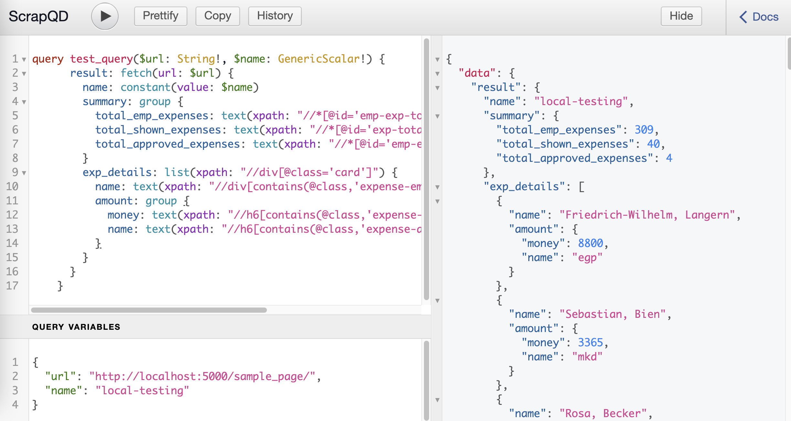

ScrapQD's documentation!
=========================

.. contents:: Table of Contents
    :depth: 3

Introduction
============
.. include:: ../README.rst
    :start-after: inclusion-marker-do-not-remove-start
    :end-before: inclusion-marker-do-not-remove-end

.. include:: ../README.rst
    :start-after: inclusion-marker-do-not-remove-start-1
    :end-before: inclusion-marker-do-not-remove-end-1

ScrapQD
=======
ScrapeQD consists of below components.

- `GraphQL UI`_

- `Query  <query.html>`_

    - `Query Type <query.html#query-type>`_ -> Document (consists of leaf type and group type)
    - `Group Type <query.html#group-type>`_
    - `Leaf Type <query.html#leaf-type>`_

- `Parser <parser.html>`_

- `Executor <executor.html>`_

GraphQL UI
==========

GraphQL UI provides flexibility to write scrapqd query and test it.
GraphQL UI supports auto completion and query documentation to develop query faster.
You can access  `UI - localhost <http://127.0.0.1:5000/scrapqd>`_.

UI is loaded with sample query and `Sample page <http://127.0.0.1:5000/scrapqd/sample_page/>`_ is accessible for practice.

You can pass custom template for the query ui.

- History - to view past 10 queries that was tested.
- Copy - Copy the content in the query window.
- Prettify - prettifies the graphql query.
- Show/Hide - Show or hides the result window.
- Query Variables - query variables editor to pass data to query when you execute.

.. include:: ../README.rst
    :start-after: inclusion-marker-do-not-remove-start-2
    :end-before: inclusion-marker-do-not-remove-end-2

.. toctree::
    :hidden:
    :caption: All Contents

    Home <self>
    query
    query_fields
    executor
    parser
    config
    guide
    Sample Page <./_static/sample.html#http://>
